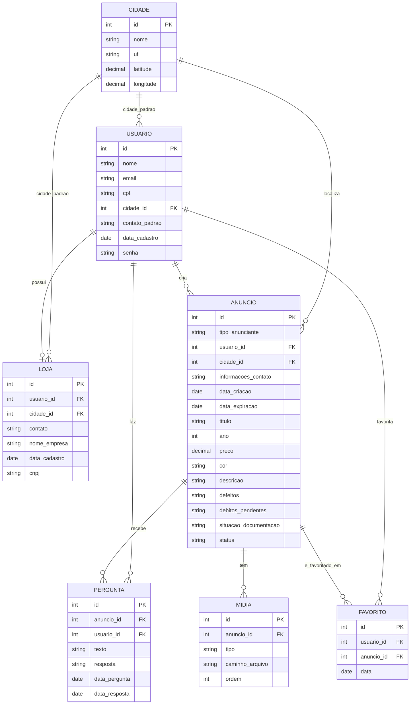
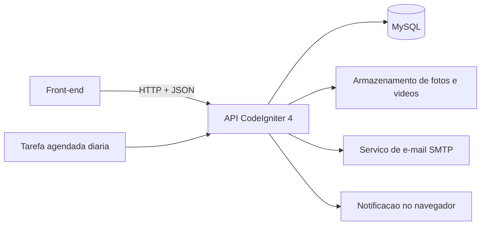

# BargainCar

## 1. Visão Geral / Escopo

**O que é o sistema**

O BargainCar é uma aplicação web de anúncios de venda, com foco regional. O sistema permite que usuários criem anúncios de carros para venda, incluindo informações do veículo, descrição e preço, e que outros usuários visualizem os anúncios de veículos disponíveis próximos à sua localização.

**Público-alvo**

Pessoas que querem vender um veículo que não usam mais, pequenos empreendedores ou empresas que querem alcançar mais clientes em sua região.

**Problema que resolve**

Sistemas de anúncios de venda frequentemente exibem produtos que despertam o interesse do usuário, mas que são geograficamente inviáveis devido à distância. O BargainCar também busca resolver o problema de pequenos empreendedores que têm dificuldade em alcançar clientes dentro de sua própria região.

**Escopo da v1**

- Criação de anúncios de venda de carros, contendo informações do veículo, descrição e preço.
- Filtragem e exibição de anúncios por proximidade geográfica (cidade de origem do usuário + cidades vizinhas).
- A negociação e a efetivação da venda ocorrem fora da plataforma (o sistema não processa pagamentos).
- Sistema de expiração de anúncios: cada anúncio permanece ativo por 30 dias.
- Três dias antes do fim do período, o anúncio entra em estado pendente e o vendedor recebe uma notificação (por e-mail e por notificação no navegador) perguntando se o veículo ainda está à venda.
- Caso o vendedor confirme, o anúncio é renovado por mais 30 dias. Caso não responda até o fim do prazo, o anúncio expira automaticamente.
- Perfil de Loja (empresa), vinculado a um Usuário, com dados próprios separados do perfil pessoal.

*Observação: embora a v1 seja restrita à categoria de veículos, o sistema deve ser modelado pensando em uma futura expansão para outras categorias de produtos.*

**Fora do escopo da v1**

- Aplicativo mobile nativo (apenas versão web).
- Pagamento ou checkout dentro da plataforma.
- Integração com calendário.
- Sistema de anúncios pagos/destaque para lojas.

---

## 2. Requisitos Funcionais e Não Funcionais

**Requisitos Funcionais (RF)**

- RF01: O sistema deve permitir que o usuário crie uma conta com nome, e-mail, CPF, cidade padrão, contato padrão e senha.
- RF02: O sistema deve mostrar somente o nome, fotos, anúncios ativos e o tempo de criação da conta para as pessoas que estiverem vendo o perfil do usuário.
- RF03: O sistema deve permitir que o usuário crie seus anúncios com informações básicas como ano, preço e cor, além de descrição do veículo, incluindo defeitos, débitos pendentes e situação da documentação.
- RF04: O sistema deve permitir que o usuário adicione fotos e vídeos ao anúncio.
- RF05: O sistema deve permitir que o usuário defina a localização e o contato do anúncio, podendo usar a localização e contato padrão do perfil ou escolher outro.
- RF06: O sistema deve permitir que o usuário marque anúncios pelos quais está interessado.
- RF07: O sistema deve permitir que o usuário envie e responda perguntas (que serão públicas) nos anúncios.
- RF08: O sistema deve notificar o vendedor por e-mail e navegador quando o anúncio estiver a 3 dias de expirar, perguntando se o veículo ainda está à venda.
- RF09: O sistema deve renovar o anúncio por mais 30 dias caso o vendedor confirme que o veículo ainda está à venda, ou expirá-lo automaticamente caso não haja resposta.
- RF10: O sistema deve exibir automaticamente anúncios de cidades próximas à cidade padrão do usuário.
- RF11: O sistema deve permitir que o usuário busque manualmente por anúncios em regiões que deseja.
- RF12: O sistema deve permitir que o usuário edite e exclua seus próprios anúncios.
- RF13: O sistema deve permitir que o usuário crie um perfil de Loja (empresa), com contato, localização padrão, nome da empresa e CNPJ opcional.
- RF14: O sistema deve permitir que o dono do anúncio exclua perguntas feitas no seu anúncio (ex: perguntas ofensivas), e que o autor exclua as próprias perguntas.
- RF15: O sistema deve permitir que o usuário faça login com CPF e senha, em uma tela separada da tela de criar conta.
- RF16: O sistema deve permitir que o usuário recupere a senha por e-mail, caso a tenha esquecido.
- RF17: O sistema deve permitir que o usuário, estando logado e possuindo uma Loja, alterne entre navegar como pessoa física ou como loja, usando a mesma conta.

**Requisitos Não Funcionais (RNF)**

- RNF01: O sistema deve exigir autenticação para acessar áreas restritas (ex: editar perfil).
- RNF02: Páginas devem carregar em no máximo 3 segundos com conexão de internet padrão.
- RNF03: Imagens enviadas pelos usuários devem ser comprimidas automaticamente para otimizar o carregamento.
- RNF04: A interface deve ser responsiva, adaptando-se a celulares, tablets e desktops.
- RNF05: O sistema deve suportar crescimento de usuários sem perda significativa de performance.
- RNF06: Arquivos de mídia devem ter limite de tamanho por upload: fotos em JPG, PNG ou WebP até 5 MB cada; vídeo em MP4 até 50 MB.
- RNF07: As senhas dos usuários devem ser armazenadas de forma criptografada.

---

## 3. Casos de Uso

### Caso de Uso: Criar Anúncio
**Ator:** Usuário
**Pré-condição:** Usuário está autenticado (e-mail e senha)
**Fluxo principal:**
1. Usuário clica em "Novo Anúncio"
2. Usuário preenche título do anúncio, descrição, informações de contato, no mínimo 3 fotos e 1 vídeo
3. Usuário clica em "Salvar"
4. Sistema exibe o anúncio no perfil do usuário e na lista de anúncios para a região do anúncio

**Fluxo alternativo:** Se o título estiver vazio ou o anúncio não tiver ao menos 3 fotos e 1 vídeo, sistema exibe erro e não salva.

### Caso de Uso: Login
**Ator:** Usuário
**Pré-condição:** Usuário possui conta cadastrada
**Fluxo principal:**
1. Usuário acessa a tela de login (separada da tela de criar conta)
2. Usuário informa CPF e senha
3. Usuário clica em "Entrar"
4. Sistema valida as credenciais e redireciona o usuário para a página inicial, autenticado

**Fluxo alternativo:** Se o CPF ou a senha estiverem incorretos, sistema exibe erro e não autentica. Um link "Esqueci minha senha" leva ao caso de uso de recuperação.

### Caso de Uso: Recuperar Senha
**Ator:** Usuário
**Pré-condição:** Usuário possui conta cadastrada
**Fluxo principal:**
1. Usuário clica em "Esqueci minha senha" na tela de login
2. Usuário informa o e-mail cadastrado
3. Usuário clica em "Enviar link"
4. Sistema exibe a mensagem "Se esse e-mail estiver cadastrado, você vai receber um link em instantes. Confira também a caixa de spam e verifique se digitou o e-mail corretamente."
5. Usuário acessa o link recebido, define uma nova senha e é redirecionado para o login

**Fluxo alternativo:** A mensagem do passo 4 é sempre a mesma, exista ou não aquele e-mail no sistema — o sistema nunca confirma nem nega se um e-mail está cadastrado. O link de redefinição expira após um tempo determinado.

### Caso de Uso: Alternar para Loja
**Ator:** Usuário (com Loja cadastrada)
**Pré-condição:** Usuário está autenticado e possui uma Loja
**Fluxo principal:**
1. Usuário clica no seletor de perfil (pessoa/loja)
2. Usuário seleciona "Loja"
3. Sistema passa a exibir a área da loja (anúncios, dados e perfil público da loja)
4. Usuário pode voltar ao modo pessoa a qualquer momento, pelo mesmo seletor

**Fluxo alternativo:** Se o usuário não tiver uma Loja cadastrada, o seletor não exibe a opção "Loja", apenas um convite para criar uma.

### Caso de Uso: Criar Loja
**Ator:** Usuário
**Pré-condição:** Usuário está autenticado
**Fluxo principal:**
1. Usuário clica em "Nova Empresa"
2. Usuário preenche os dados da empresa (contato, localização padrão, nome da empresa e, opcionalmente, CNPJ)
3. Usuário clica em "Salvar"
4. Sistema cria e exibe aquele perfil como uma loja, e passa a aceitar a criação de anúncios em nome dela

**Fluxo alternativo:** Se algum dos campos obrigatórios de "dados da Empresa" estiver vazio, sistema exibe erro e não salva.

### Caso de Uso: Excluir Anúncio
**Ator:** Usuário
**Pré-condição:** Usuário está autenticado (e-mail e senha)
**Fluxo principal:**
1. Usuário clica em "Perfil"
2. Usuário seleciona o anúncio que quer excluir
3. Usuário clica em "Excluir"
4. Sistema exibe um pedido de confirmação; se aceito, o anúncio é excluído

**Fluxo alternativo:** Se o pedido de confirmação não for aceito ou for ignorado, o anúncio não é apagado.

### Caso de Uso: Editar Anúncio
**Ator:** Usuário
**Pré-condição:** Usuário está autenticado (e-mail e senha)
**Fluxo principal:**
1. Usuário clica em "Perfil"
2. Usuário seleciona o anúncio que quer editar
3. Usuário clica em "Editar"
4. Sistema exibe o anúncio com os dados atualizados, no perfil do usuário e na lista de anúncios da região

**Fluxo alternativo:** Se o título estiver vazio ou o anúncio ficar sem ao menos 3 fotos e 1 vídeo, sistema exibe erro e não salva.

### Caso de Uso: Buscar Anúncios
**Ator:** Usuário
**Pré-condição:** Usuário está autenticado (e-mail e senha)
**Fluxo principal:**
1. Usuário clica na barra de pesquisa
2. Usuário digita o título do anúncio e a região
3. Usuário clica em "Buscar"
4. Sistema exibe os anúncios com o nome buscado na região mais próxima da localização padrão

**Fluxo alternativo:** Para ver anúncios de locais mais distantes, o usuário pode escolher outras regiões manualmente.

### Caso de Uso: Visualizar Anúncio
**Ator:** Usuário
**Pré-condição:** Usuário está autenticado (e-mail e senha)
**Fluxo principal:**
1. Usuário clica em algum anúncio na página
2. Usuário lê os dados do anúncio
3. Usuário clica nas fotos
4. Sistema exibe as fotos disponíveis no anúncio

**Fluxo alternativo:** Caso o anúncio tenha sido excluído ou expirado, o sistema exibe a mensagem "Este anúncio não está mais disponível" e redireciona o usuário para a página de anúncios.

### Caso de Uso: Adicionar Anúncio aos Favoritos
**Ator:** Usuário
**Pré-condição:** Usuário está autenticado (e-mail e senha)
**Fluxo principal:**
1. Usuário clica em algum anúncio na página
2. Usuário lê os dados do anúncio
3. Usuário clica em "Favoritar"
4. Sistema exibe uma mensagem informando que o anúncio foi adicionado aos favoritos

**Fluxo alternativo:** Se o usuário clicar em "Favoritar" uma segunda vez, o anúncio sai da lista de favoritos.

### Caso de Uso: Ver Lista de Favoritos
**Ator:** Usuário
**Pré-condição:** Usuário está autenticado
**Fluxo principal:**
1. Usuário acessa a página "Favoritos"
2. Sistema exibe a lista de anúncios favoritados pelo usuário
3. Usuário clica em um dos anúncios da lista
4. Sistema abre o anúncio normalmente

**Fluxo alternativo:** Se o anúncio favoritado já tiver expirado ou sido excluído, ele continua aparecendo na lista de favoritos. Ao clicar, o sistema exibe a mesma mensagem "Este anúncio não está mais disponível" (RN12) e o usuário pode removê-lo dos favoritos a partir dali.

---

## 4. Modelagem de Dados

### Entidades e Atributos

**Cidade**
`id, nome, uf, latitude, longitude`

**Usuário**
`id, nome, email, cpf, cidade_id (FK, cidade padrão), contato_padrao, data_cadastro, senha`

**Loja**
`id, usuario_id (FK), cidade_id (FK, cidade padrão da loja), contato, nome_empresa, data_cadastro, cnpj (opcional)`

**Anúncio**
`id, tipo_anunciante (pessoa ou loja), usuario_id (FK), cidade_id (FK, padrão ou variante), informacoes_contato (padrão ou variante), data_criacao, data_expiracao, titulo, ano, preco, cor, descricao, defeitos, debitos_pendentes, situacao_documentacao, status (ativo, pendente, expirado)`

**Mídia**
`id, anuncio_id (FK), tipo (foto ou video), caminho_arquivo, ordem`

**Pergunta**
`id, anuncio_id (FK), usuario_id (FK, quem perguntou), texto, resposta (vazia até o dono responder), data_pergunta, data_resposta`

**Favorito**
`id, usuario_id (FK), anuncio_id (FK), data`

*Notas de modelagem:*
- `Cidade` guarda latitude e longitude para calcular a distância entre cidades (ver seção Arquitetura). Os nomes das cidades e coordenadas vêm de uma base pública dos municípios brasileiros, importada uma vez para o MySQL.
- `Mídia` existe porque um anúncio pode ter várias fotos e vários vídeos. O arquivo em si fica no servidor; o banco guarda só o caminho.
- `data_expiracao` no Anúncio permite ao sistema descobrir quais anúncios estão a 3 dias de expirar (RF08).
- `Pergunta` guarda pergunta e resposta juntas: a resposta só pode ser escrita pelo dono do anúncio.

### Relacionamentos

- **Cidade → Usuário:** 1:N — uma Cidade é a cidade padrão de vários Usuários; cada Usuário tem uma cidade padrão.
- **Cidade → Loja:** 1:N — mesma lógica para a cidade padrão da Loja.
- **Cidade → Anúncio:** 1:N — uma Cidade pode ter vários Anúncios; cada Anúncio está em uma cidade.
- **Usuário → Loja:** 1:1 — um Usuário pode ter, no máximo, uma Loja; toda Loja pertence a exatamente um Usuário.
- **Usuário → Anúncio:** 1:N — um Usuário cria vários Anúncios (como pessoa ou em nome da Loja); cada Anúncio pertence a um único Usuário.
- **Anúncio → Mídia:** 1:N — um Anúncio tem várias fotos/vídeos; cada Mídia pertence a um Anúncio.
- **Anúncio → Pergunta:** 1:N — um Anúncio recebe várias Perguntas; cada Pergunta pertence a um Anúncio.
- **Usuário → Pergunta:** 1:N — um Usuário faz várias Perguntas; cada Pergunta tem um autor.
- **Usuário → Favorito:** 1:N — um Usuário favorita vários Anúncios; cada registro pertence a um Usuário.
- **Anúncio → Favorito:** 1:N — um Anúncio pode ser favoritado por vários Usuários; cada registro aponta para um Anúncio.

*Observação: Usuário e Anúncio têm uma relação N:N entre si por meio de Favorito, que a quebra em dois relacionamentos 1:N.*

### Diagrama Entidade-Relacionamento

---

## 5. Arquitetura

### Visão geral

O BargainCar é dividido em um front-end e uma API, que se comunicam por HTTP em formato JSON.

| Camada | Tecnologia |
|---|---|
| Front-end | HTML, CSS e JavaScript puro, em projeto separado; usa `fetch` para consumir a API |
| Back-end (API) | PHP com CodeIgniter 4 |
| Banco de dados | MySQL |

Dentro da API, o CodeIgniter segue o padrão MVC adaptado para API: **Rotas** apontam para **Controllers**, que aplicam as regras de negócio e usam **Models** (um por tabela) para acessar o MySQL. A resposta é sempre JSON, sem Views.

### Decisões de arquitetura por necessidade do sistema

| Necessidade | Origem | Solução adotada |
|---|---|---|
| Autenticação | RNF01 | Login com CPF e senha, em tela separada do cadastro; a API devolve um token que o front envia nas requisições seguintes. Senhas armazenadas com hash (RNF07). |
| Recuperação de senha | RF16 | Reaproveita o SMTP já usado para a expiração de anúncios (RF08): envia um link de redefinição com token temporário. |
| Proximidade entre cidades | RF10, RF11 | Tabela `Cidade` com latitude e longitude. A distância é calculada no MySQL (fórmula de Haversine ou `ST_Distance_Sphere`), com raio de 100 km. Sem dependência de API externa a cada busca. |
| Padronização das cidades | RF01, RF05 | O usuário escolhe a cidade em uma lista (base do IBGE importada para `Cidade`), em vez de digitar texto livre. |
| Fotos e vídeos | RF04, RNF03, RNF06 | Arquivos guardados no servidor, com o caminho na tabela `Mídia`. Mínimo de 3 fotos e 1 vídeo por anúncio. Imagens comprimidas no upload; limite de tamanho por arquivo. O PHP limita uploads por padrão (`upload_max_filesize` e `post_max_size`), então esses valores precisam ser aumentados no servidor. |
| Expiração e renovação | RF08, RF09 | Tarefa agendada (cron) que roda todo dia e executa um comando do CodeIgniter: marca como pendente os anúncios a 3 dias de expirar, notifica o vendedor e expira os vencidos. |
| E-mail | RF08 | Envio via SMTP, usando a biblioteca de e-mail do CodeIgniter. |
| Notificação no navegador | RF08 | Web Push (exige HTTPS e que o usuário autorize as notificações). |
| Front separado da API | Decisão de arquitetura | A API precisa liberar o acesso do front via configuração de CORS. |

### Rotas da API

Todas as rotas usam o plural e `id` para identificar o registro. Rotas marcadas com 🔒 exigem usuário autenticado.

| Verbo | Rota | Ação |
|---|---|---|
| POST | `/auth/cadastro` | Cria uma conta |
| POST | `/auth/login` | Autentica com CPF e senha, devolve o token |
| POST | `/auth/esqueci-senha` | Envia o e-mail de redefinição de senha |
| POST | `/auth/redefinir-senha` | Define nova senha a partir do link recebido por e-mail |
| GET | `/usuarios/{id}` | Perfil público (só nome, fotos, anúncios ativos e tempo de conta, conforme RF02) |
| PUT | `/usuarios/me` 🔒 | Edita os próprios dados |
| POST | `/lojas` 🔒 | Cria a loja do usuário |
| GET | `/lojas/{id}` | Página pública da loja |
| PUT | `/lojas/{id}` 🔒 | Edita a loja (só o dono) |
| POST | `/anuncios` 🔒 | Cria um anúncio |
| GET | `/anuncios?titulo=gol&cidade_id=7` | Busca anúncios ativos e pendentes por título e cidade (e cidades num raio de 100 km). Sem `cidade_id`, usa a cidade padrão do usuário |
| GET | `/anuncios/{id}` | Mostra um anúncio |
| PUT | `/anuncios/{id}` 🔒 | Edita o anúncio (só o dono) |
| DELETE | `/anuncios/{id}` 🔒 | Exclui o anúncio (só o dono) |
| POST | `/anuncios/{id}/renovar` 🔒 | Confirma que o veículo ainda está à venda (renova por 30 dias) |
| POST | `/anuncios/{id}/midias` 🔒 | Envia foto ou vídeo para o anúncio |
| DELETE | `/midias/{id}` 🔒 | Remove uma mídia (só o dono do anúncio) |
| GET | `/anuncios/{id}/perguntas` | Lista as perguntas públicas do anúncio |
| POST | `/anuncios/{id}/perguntas` 🔒 | Faz uma pergunta |
| PUT | `/perguntas/{id}` 🔒 | Responde a pergunta (só o dono do anúncio) |
| DELETE | `/perguntas/{id}` 🔒 | Exclui a pergunta (dono do anúncio ou autor da pergunta) |
| GET | `/favoritos` 🔒 | Lista os favoritos do usuário |
| POST | `/anuncios/{id}/favoritar` 🔒 | Favorita ou desfavorita (alterna) |
| GET | `/cidades?busca=ceres` | Lista cidades para o campo de escolha |

---

## 6. Regras de Negócio

**Anúncios**
- RN01: Um anúncio só pode ser salvo com título, no mínimo 3 fotos e 1 vídeo.
- RN02: Fotos devem ser JPG, PNG ou WebP, com até 5 MB cada (máximo de 10 por anúncio). O vídeo deve ser MP4, com até 50 MB (1 por anúncio).
- RN03: Somente o dono do anúncio pode editá-lo ou excluí-lo.
- RN04: A exclusão de um anúncio exige confirmação do usuário.
- RN05: Cada anúncio pertence a um único usuário. Quando criado em nome da loja, o campo `tipo_anunciante` é `loja`.
- RN06: Contato e localização do anúncio usam, por padrão, os do perfil, mas o usuário pode escolher outros.

**Autenticação**
- RN06.1: O login é feito com CPF e senha, em tela separada da tela de criar conta.
- RN06.2: A recuperação de senha é identificada pelo e-mail (não pelo CPF): o sistema envia um link de redefinição, válido por tempo limitado.
- RN06.3: A mensagem de confirmação é sempre a mesma, exista ou não o e-mail informado no sistema. Para orientar quem digitou errado, a mensagem sugere conferir se o e-mail foi digitado corretamente, sem confirmar nem negar se ele está cadastrado.
- RN06.4: A Loja não tem login próprio. O dono acessa a área da loja alternando o modo de navegação dentro da mesma conta.

**Ciclo de vida do anúncio**
- RN07: Todo anúncio nasce com status `ativo` e fica no ar por 30 dias.
- RN08: Nos últimos 3 dias antes da expiração, o anúncio passa a `pendente`, mas continua ativo e no ar (visível nas buscas e aberto a favoritos e perguntas), e o vendedor é notificado por e-mail e pelo navegador. O anúncio permanece pendente até que o vendedor responda.
- RN09: Se o vendedor confirmar que o veículo ainda está à venda, o anúncio volta a `ativo` e é renovado por mais 30 dias.
- RN10: Se o vendedor não responder até o fim dos 30 dias, o anúncio sai do ar e passa a `expirado` automaticamente.
- RN11: Um anúncio expirado não pode ser reativado. Para anunciar novamente, o vendedor precisa criar um novo anúncio.
- RN12: Anúncio expirado ou excluído não aparece nas buscas. Quem tentar abri-lo vê a mensagem "Este anúncio não está mais disponível" e é levado à página de anúncios. Essa mesma mensagem aparece ao clicar em um anúncio expirado/excluído a partir da lista de Favoritos.

**Busca e localização**
- RN13: A busca pública exibe apenas anúncios com status `ativo` ou `pendente`. Anúncios `expirados` não aparecem. Esse filtro é aplicado pelo back-end, não escolhido pelo usuário.
- RN14: A busca sem cidade informada usa a cidade padrão do usuário e mostra também as cidades num raio de 100 km.
- RN15: Na busca, o usuário pode escolher outra cidade para ver anúncios de locais mais distantes. O raio é fixo em 100 km e não pode ser ajustado; o que muda é a cidade de referência.

**Perfil, loja e privacidade**
- RN16: O perfil público do usuário mostra apenas nome, fotos, anúncios ativos e tempo de criação da conta. CPF, CNPJ, contato padrão e localização padrão nunca são exibidos publicamente.
- RN17: Um usuário pode ter no máximo uma loja, com dados separados dos dados pessoais.
- RN18: O CNPJ da loja é opcional.

**Interação**
- RN19: As perguntas nos anúncios são públicas, e somente o dono do anúncio pode respondê-las.
- RN20: O dono do anúncio pode excluir qualquer pergunta feita no seu anúncio (ex: perguntas ofensivas). O autor pode excluir as próprias perguntas.
- RN21: Favoritar um anúncio já favoritado o remove dos favoritos.
- RN21.1: Um anúncio expirado ou excluído permanece na lista de favoritos de quem o favoritou (não é removido automaticamente); o usuário pode excluí-lo manualmente a qualquer momento.
- RN21.1: O usuário pode favoritar os próprios anúncios.

**Negociação**
- RN22: O sistema não processa pagamentos. A negociação e a venda ocorrem fora da plataforma.

---

## Pendências (decisões a tomar)

- [ ] Avaliar, no futuro, denúncia de perguntas e um perfil de administrador para moderação.
- [ ] Desenhar o diagrama ER no MySQL Workbench (o Mermaid acima serve de referência).
